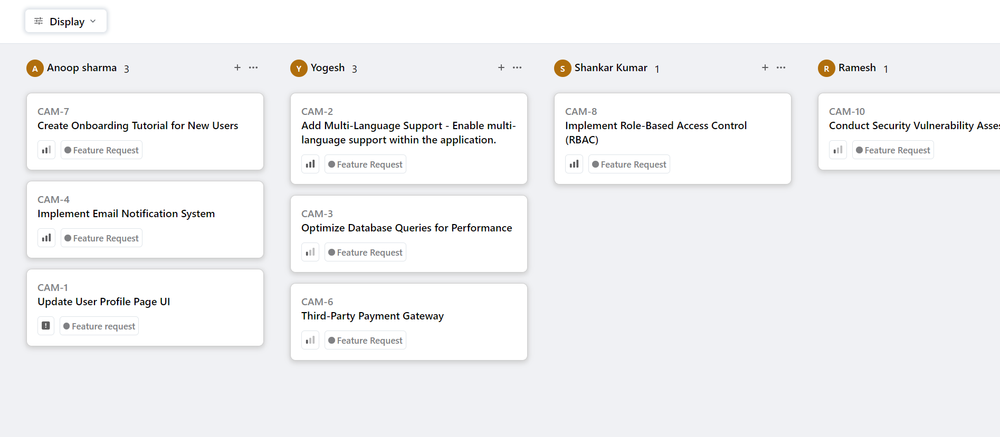

# Kanban Board Application

This **Kanban Board Application** is developed using **React JS** and utilizes the API provided by [QuickSell](https://api.quicksell.co/v1/internal/frontend-assignment) to dynamically manage and organize tasks. It offers users the ability to streamline their workflow by grouping and sorting tasks based on various criteria, with a user-friendly interface designed to improve productivity.

Additionally, the application saves user preferences for grouping and sorting, ensuring a seamless experience even after page reloads.

## Key Features

- **Dynamic Grouping**: Organize tasks by **Status**, **User**, or **Priority** for enhanced task visualization and management.
- **Advanced Sorting**: Sort tasks by **Priority** or **Title** to help users focus on the most important tasks.
- **Persistent View State**: The application automatically saves grouping and sorting preferences in local storage, ensuring that user settings are preserved across sessions.
- **Priority Levels**: Tasks are assigned one of the following priority levels to help users better manage their workload:
  - **Urgent** (4)
  - **High** (3)
  - **Medium** (2)
  - **Low** (1)
  - **No Priority** (0)
- **Responsive Design**: The application is optimized for various screen sizes, offering a consistent user experience on both desktop and mobile devices.

## Screenshots

  
*Screenshot of the Kanban Board user interface*  

## Live Demo

Explore the live version of the Kanban Board Application [here](https://kanban-board-one-virid.vercel.app/).

## Getting Started

Follow the steps below to run the application locally:

### Prerequisites
Ensure that **Node.js** and **npm** are installed on your machine.

### Installation Steps

1. **Clone the Repository**:
    ```bash
    git clone https://github.com/mpatwa98/Kanban-Board.git
    ```

2. **Navigate to the Project Directory**:
    ```bash
    cd kanban-board
    ```

3. **Install Dependencies**:
    ```bash
    npm install
    ```

4. **Start the Development Server**:
    ```bash
    npm start
    ```

5. **Access the Application**:  
   Open your browser and navigate to `http://localhost:3000` to use the application.

## Usage Instructions

1. **Display Tasks**: Click on the "Display" button to fetch and view tasks from the API.
2. **Group Tasks**: Choose from grouping options such as Status, User, or Priority for better task organization.
3. **Sort Tasks**: Sort tasks by Priority or Title for more effective task management.
4. **Persistent Settings**: Your grouping and sorting preferences are automatically saved in local storage, maintaining your settings across page reloads.

## Contribution Guidelines

Contributions to this project are welcome! If you'd like to contribute, follow these steps:

1. **Fork the Repository**: Create a fork of the repository in your GitHub account.
2. **Create a Branch**: Create a new branch for your feature or bug fix.
    ```bash
    git checkout -b feature/your-feature-name
    ```
3. **Implement Changes**: Develop your feature or apply the necessary bug fix.
4. **Push Changes**:
    ```bash
    git push origin feature/your-feature-name
    ```
5. **Submit a Pull Request**: Once you're ready, submit a pull request with detailed explanations of your changes.

## Contact Information

For any inquiries, suggestions, or feedback, please contact the project maintainer:

- **Name**: Mandeep Patwa
- **Email**: [mandeep.patwa.met21@itbhu.ac.in](mailto:mandeep.patwa.met21@itbhu.ac.in)

